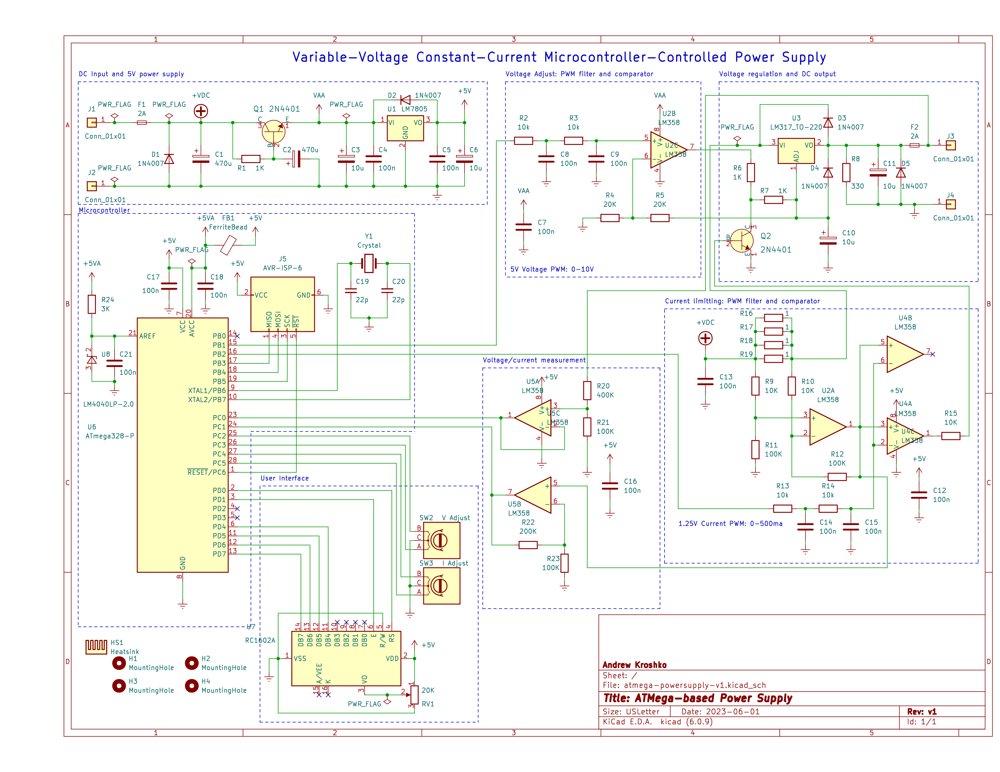

A Variable-Voltage Constant-Current ATMega-based Power Supply
=============================================================

This project is a challenge to myself to build the best
variable-voltage constant-current power supply I could based on
ubiquitous components such as the LM317 voltage regulator, LM358 or
ATMega328 microcontroller.

The design is loosely based off of
[https://www.youtube.com/playlist?list=PLBF35875F73B5C9B5](https://www.youtube.com/playlist?list=PLBF35875F73B5C9B5)
by EEVblog.  However, it uses components I cannot obtain such as the
LT3080.

# Things to do

I wouldn't recommend building it yourself quite yet.  There are some
issues with this design and there will be a version 1.1
at some point.

- add a photo of my prototype
- test prototype under different loads
- add a model to calibrate to in software
- use an easier-to-get LCD display
